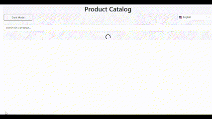

# TP React Hooks - Application de Gestion de Produits

Ce TP a pour objectif de mettre en pratique l'utilisation des Hooks React (useState, useEffect, useContext) ainsi que la création de Hooks personnalisés.

## Installation et configuration initiale

1. Cloner le dépôt :
```bash
git clone https://github.com/ayman-kacemi47/tp-react-hooks.git
cd tp-react-hooks
```


2. Installer les dépendances :
```bash
npm install
```

3. Lancer l'application :
```bash
npm start
```

### Exercice 1 : État et Effets 
#### Objectif : Implémenter une recherche en temps réel

- [ ] 1.1 Modifier le composant ProductSearch pour utiliser la recherche
- [ ] 1.2 Implémenter le debounce sur la recherche
- [ ] 1.3 Documenter votre solution ici


## réponse pour l'exercice 1 :
#### 1.1
J'ai utilisé ```const [searchTerm, setSearchTerm] = useState('');``` dans App.js au lieu du ProductSearch donc pour donner l'accés a le component ProductSearch.js pour changer et afficher la valeur searchTerm,  et pour ProductList searchTerm donc je peux l'utiliser dans le filtre, tout ça grace à le hook createContext.

voilà quelque image d'application où j'ai traité les 3 cas 
   - la liste des produits est vide
   

   - la liste des produits est pleine mais le searchTerm ne correspon à aucun produit
   

   - la liste filtré selon le terme entré
   
   - pas de difficultés renconctrées 😊

#### 1.2
J'ai crée un hook ```useDebounce``` qui prend comme argument le terme à chercher ainsi que le delay.
   

   - difficultés trouvé avec le debounce c'est que quand je vide la bar de recherche la list affiche toujour le dernier resultat au lieu d'initialiser la liste car le delay de debounce affecte la condition qui verifie la valeur de searchTerme, donc j'ai utilisé une autre condition pour reinitialiser la liste si le searchTerme est vide.


### Exercice 2 : Context et Internationalisation
#### Objectif : Gérer les préférences de langue

- [ ] 2.1 Créer le LanguageContext
- [ ] 2.2 Ajouter le sélecteur de langue
- [ ] 2.3 Documenter votre solution ici

## Gestion de la Langue dans l'Application React

### Contexte de la Langue

J'ai créé un contexte de langue (`LanguageContext`) pour gérer la langue sélectionnée et les traductions des éléments de la page. Voici comment cela fonctionne :

- Le `LanguageContext.Provider` fournit les valeurs `selectedLanguage`, `setSelectedLanguage` et `translations` à l'application.

### Fichier translations.json

Le fichier `translations.json` contient les traductions des éléments de la page en trois langues : arabe, français et l'anglais.

et dans chaque component selon la valeur de  `selectedLanguage.value` j'affiche la bonne valeur à partir de `translations`, et pour l'arabe je change la direction d'écriture graçe a ce code:
```js
   useEffect(()=>{
    const  isRtl = selectedLanguage.value === "ar" ;
    document.documentElement.dir = isRtl ? "rtl" : "ltr";
  },[selectedLanguage]);
```

### Resultat:
   
### Exercice 3 : Hooks Personnalisés
#### Objectif : Créer des hooks réutilisables

- Grâce à des hooks abstraits que l'on peut utiliser plusieurs fois, comme le hook `useLocalStorage` qui contient des fonctions `getter` et `setter` pour lire et écrire dans le localStorage de l'application en utilisant une clé et une valeur.

#### Resultat:
   


### Exercice 4 : Gestion Asynchrone et Pagination
#### Objectif : Gérer le chargement et la pagination

- [ ] 4.1 Ajouter le bouton de rechargement
- [ ] 4.2 Implémenter la pagination
- [ ] 4.3 Documenter votre solution ici

# 📦 Gestion des Produits avec Pagination et Rechargement  

Ce projet implémente une liste de produits avec un système de **pagination** et un bouton **flottant de rechargement**.  

## 🎯 Fonctionnalités  
✅ Chargement dynamique des produits via `useEffect`  
✅ Rechargement des produits avec un **bouton flottant**  
✅ Système de **pagination** avec gestion des boutons "Précédent" et "Suivant"  
✅ Indicateur de chargement  

---

## 🚀 Rechargement  

### 🖥️ Démonstration  

  

### 🔧 Fonctionnement  

Un **bouton flottant** incrémente une variable `reloadCounter` avec `useState`.  
L'effet `useEffect` qui gère le `fetch` des produits est automatiquement déclenché lorsque `reloadCounter`, `skip` ou `limit` changent :  

```js
const [reloadCounter, setReloadCounter] = useState(0); // State for reload

useEffect(() => {
  console.log("fetch number ", reloadCounter);
  const fetchProducts = async () => {
    ...
  };
  fetchProducts();
}, [reloadCounter, skip, limit]);
```

## 📌 Pagination  

### 🖥️ Démonstration  

  

### 🔧 Fonctionnement  

La pagination utilise les paramètres `skip` et `limit` de l'API pour afficher uniquement une partie des produits.  
Les boutons **"Précédent"** et **"Suivant"** permettent de naviguer entre les pages et sont automatiquement désactivés si l'utilisateur est sur la première ou la dernière page.  

### 📜 Code de la pagination  

```js
<nav className="mt-4">
  <ul className="pagination justify-content-center">
    <!-- Bouton Précédent -->
    <li className="page-item">
      <button 
        className={`page-link ${!((skip/limit)+1 > 1) ? 'disabled-page-link' : ''}`} 
        onClick={(skip/limit)+1 > 1 ? () => setSkip(prev => prev - limit) : null} 
        disabled={!((skip/limit)+1 > 1)}
      >
        Précédent
      </button>
    </li>

    <!-- Affichage du numéro de page -->
    <li className="page-item">
      <span className="page-link">
        Page {(skip / limit) + 1} sur {Math.ceil(total / limit)}
      </span>
    </li>

    <!-- Bouton Suivant -->
    <li className="page-item">
      <button 
        className={`page-link ${!((skip/limit)+1 < Math.ceil(total/limit)) ? 'disabled-page-link' : ''}`} 
        onClick={(skip/limit)+1 < Math.ceil(total/limit) ? () => setSkip(prev => prev + limit) : null} 
        disabled={!((skip/limit)+1 < Math.ceil(total/limit))}
      >
        Suivant
      </button>
    </li>
  </ul>
</nav>
